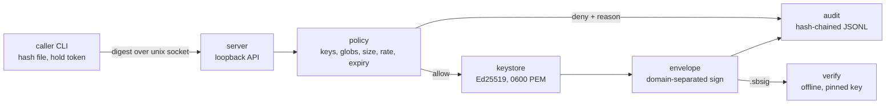

# signbooth

[English](README.md) | [中文](README.zh.md) | [日本語](README.ja.md)

[](LICENSE) [](go.mod) [](CHANGELOG.md)  [](CONTRIBUTING.md)

**signbooth：オープンソースの成果物署名デーモン——秘密鍵は監査された単一のローカルプロセスに留まり、CI ジョブは呼び出し元ごとのポリシーの下、ループバック API 経由で署名する。**


```bash
git clone https://github.com/JaydenCJ/signbooth.git && cd signbooth && go install ./cmd/signbooth
```

> プレリリース：v0.1.0 はまだ Go module proxy にバージョンタグがありません。上記の通りソースからインストールしてください。単一の静的バイナリで、ランタイム依存はゼロです。

## なぜ signbooth？

誰もが抱える後ろめたい秘密：リリース署名鍵は CI の環境変数に置かれ、あらゆるジョブのあらゆるステップから読め、デバッグログの `env` 一発で漏れ、失効させるには全箇所で一斉に鍵を交換するしかない。重量級の解決策——sigstore、クラウド KMS、Vault クラスタ——は本物の保証と引き換えにネットワーク依存・アカウント・運用負荷を要求し、個人プロジェクトやエアギャップのビルドマシンには見合わない。signbooth はその欠けた中間層だ：単一の静的バイナリが Ed25519 鍵をロックダウンされた一つのプロセスに保持し、unix ソケット越しに SHA-256 ダイジェストへ署名する。各呼び出し元はハッシュ化して保存される専用 bearer トークンを受け取り、ポリシー——使える鍵、成果物 glob、サイズ上限、毎時レート、有効期限——に束縛される。許可も拒否もすべてハッシュ連鎖の監査ログに残り、トークンの失効はコマンド一つ、再起動不要。署名は booth を知らないマシンでも、固定した公開鍵に対して完全オフラインで検証できる。

| | signbooth | CI 環境変数の鍵 | sigstore / cosign | クラウド KMS / Vault transit |
| --- | --- | --- | --- | --- |
| ビルドジョブへの鍵露出 | 皆無——ジョブは制限付きトークンのみ、鍵はデーモン内 | 全ジョブが秘密鍵そのものを持つ | キーレス：鍵の代わりに OIDC アイデンティティ | 露出しないが、署名者全員にクラウド資格情報が必要 |
| オフライン / エアギャップで動く | 動く、ループバックのみ | 動く | 動かない——OIDC 発行者と透明性ログが必要 | 動かない——ネットワークとサービスが必要 |
| 呼び出し元ごとのポリシー（鍵・glob・サイズ・レート・期限） | 組み込み | なし | リポジトリ/ID 単位で、成果物 glob はない | IAM ポリシーのみ、成果物は関知しない |
| 利用者一つだけの失効 | `caller rm`、即時、再起動不要 | 全箇所で鍵をローテーション | 証明書 / ID を失効 | 資格情報のローテーションか失効 |
| 改竄検知つきローカル監査証跡 | ハッシュ連鎖 JSONL、`audit verify` | なし | 公開透明性ログ | プロバイダの監査サービス、追加費用 |
| 導入コスト | バイナリ一つ、数秒の `init` | ゼロ（それこそが問題） | CLI + OIDC + Rekor/Fulcio サービス | クラスタかクラウドアカウント + SDK |
| ランタイム依存 | なし（Go 標準ライブラリ） | — | 複数のサービス | プロバイダ SDK |

<sub>比較は 2026-07 時点の各上流ドキュメントに基づく。sigstore のキーレスフローは公開 OSS サプライチェーンには正解である。signbooth が狙うのは、OIDC の往復が不可能または望まれないプライベート・ローカル・エアギャップのビルドだ。</sub>

## 主な機能

- **鍵はブースから出ない** —— Ed25519 秘密鍵は 0600 の unix ソケットの奥、単一プロセスにのみ存在する。API はダイジェストを受け取り封筒を返すだけで、鍵のバイトも成果物のバイトも通らない。
- **呼び出し元ごとのポリシーをリクエスト単位で強制** —— 各トークンは鍵の名前、成果物 glob（`dist/**`——`*` は決して `/` を跨がない）、サイズ上限、毎時レート、有効期限に束縛される。ポリシー変更と失効はデーモン再起動なしで次のリクエストから効く。
- **改竄検知つき監査チェーン** —— 許可・ポリシー拒否・不正トークンをハッシュ連鎖 JSONL へ追記。`audit verify` は最初に編集・削除・並べ替えされた行を特定し、複数ライターもファイルロックで一本の鎖を共有する。
- **検証はオフラインかつ疑り深い** —— `.sbsig` 封筒は自己記述 JSON だが、公開鍵のピン留めは必須。ドメイン分離署名の検証、再署名を防ぐ指紋の照合、成果物のダイジェストとサイズの再確認を行う。
- **正直な失敗の仕方** —— 壊れたポリシーはフェイルクローズ、曖昧なトークンハッシュは認証拒否。拒否理由は同じ文言で呼び出し元と監査ログの両方へ渡り、終了コードは「ノー」（1）と「故障」（2/3）を区別する。
- **依存ゼロ、ループバックのみ** —— 純粋な Go 標準ライブラリ、単一静的バイナリ。デーモンは設計上ループバック以外のバインドを拒否し、どこへも何も送らない。テストは 90 件のオフラインスイートとエンドツーエンドのスモークスクリプト。

## クイックスタート

運用者：booth と鍵一つ、制限付き呼び出し元一つを作る（実際のキャプチャ出力、トークンは伏せ字）：

```bash
signbooth init
signbooth key new release
signbooth caller add ci --key release --artifact 'dist/**' --rate 100 --ttl 30d
signbooth serve &
```

```text
caller    ci
keys      release
artifacts dist/**
max size  unlimited
rate      100/hour
expires   2026-08-12T05:03:40Z
token     sbt_aaaaaaaaaaaaaaaaaaaaaaaaaaaaaaaaaaaaaaaaaaaaaaaa
          (shown once — store it in your CI secret store, never on disk)
```

CI ジョブ：トークンで署名——ファイルはローカルでハッシュされ、ソケットを通るのはダイジェストだけ：

```bash
export SIGNBOOTH_TOKEN=sbt_aaaaaaaaaaaaaaaaaaaaaaaaaaaaaaaaaaaaaaaaaaaaaaaa
signbooth sign dist/app.tar.gz --key release --name dist/app.tar.gz
```

```text
signed    dist/app.tar.gz
digest    sha256:adcab8d52d684b0779e0017d98ab39800875b336f48bf0075e6086313627f466
key       release (SHA256:PCgLl4hbXT41USaV4/Vnm0B3OA5yIJQmoC9+7C8800Y)
caller    ci
envelope  dist/app.tar.gz.sbsig
```

誰でも、どこでも、完全オフラインで——そして同じトークンは自分の glob の外へ一歩も出られない：

```text
$ signbooth verify dist/app.tar.gz --pub release.pem
verified  dist/app.tar.gz
digest    sha256:adcab8d52d684b0779e0017d98ab39800875b336f48bf0075e6086313627f466
size      1861 bytes
key       release (SHA256:PCgLl4hbXT41USaV4/Vnm0B3OA5yIJQmoC9+7C8800Y)
caller    ci
signed    2026-07-13T05:03:41Z
$ signbooth sign secret.pem --key release --name secrets/key.pem
signbooth: daemon replied 403: denied by policy: artifact "secrets/key.pem" matches no allowed pattern
```

そのまま実行できる運用者 / CI / 利用者スクリプトは [examples/](examples/README.md) に。

## コマンドとポリシーフラグ

| コマンド | 役割 | 効果 |
| --- | --- | --- |
| `init`、`key new/ls/export`、`caller add/ls/rm` | 運用者 | booth ホーム、鍵（PKIX PEM 書き出し）、呼び出し元トークンの管理 |
| `serve` | 運用者 | `unix://$SIGNBOOTH_HOME/booth.sock` または `127.0.0.1:PORT` でデーモンを起動 |
| `sign <file>`、`status`、`whoami` | 呼び出し元 | デーモン経由で署名。稼働状態と自分のポリシーを確認 |
| `verify <file>` | 誰でも | `--pub key.pem` か `--fingerprint SHA256:…` でオフライン検証 |
| `audit show/verify` | 運用者 | ログを読む。ハッシュチェーンを端から端まで検証 |

| ポリシーフラグ（`caller add`） | 既定値 | 効果 |
| --- | --- | --- |
| `--key NAME`（複数可） | 必須 | この呼び出し元が使える鍵名。`'*'` = 任意の鍵 |
| `--artifact GLOB`（複数可） | 必須 | 許可する成果物名。`*`/`?` は `/` 区切りの中だけ、`**` は跨ぐ |
| `--max-size N` | 無制限 | 成果物の最大サイズ（例 `64MB`） |
| `--rate N` | 無制限 | 毎時の署名回数 |
| `--ttl D` | 無期限 | トークンの寿命（例 `30d`、`720h`） |

ワイヤ形式とファイル形式——ルート、署名対象ペイロード、ドメイン分離、監査チェーン——の仕様は [docs/protocol.md](docs/protocol.md) に。

## アーキテクチャ



左半分はデーモンが必要。右側の `verify` に要るのは成果物と封筒、そしてピン留めした公開鍵だけ。

## ロードマップ

- [x] v0.1.0 —— 署名デーモン（unix ソケット / ループバック TCP）、glob・サイズ・レート・TTL つき呼び出し元別ポリシー、ハッシュ連鎖監査ログ、オフラインのピン留め検証、鍵と呼び出し元のライフサイクル CLI、依存ゼロ、90 テスト + スモークスクリプト
- [ ] `caller update`：トークンを替えずにポリシーを編集
- [ ] 鍵ストアの保存時 age 暗号化（`serve` 時にパスフレーズで解錠）
- [ ] 封筒のタイムスタンプへ監査チェーン先頭による副署名
- [ ] systemd ソケットアクティベーションと堅牢化 unit ファイル例
- [ ] `.sbsig` に加えて in-toto / SLSA 来歴ステートメントを任意出力

全リストは [open issues](https://github.com/JaydenCJ/signbooth/issues) を参照。

## コントリビュート

バグ報告、ポリシーモデルへの批判、pull request を歓迎します——ローカルの手順（`go test ./...` と `SMOKE OK` を印字する `scripts/smoke.sh`）は [CONTRIBUTING.md](CONTRIBUTING.md) へ。入門しやすい課題は [good first issue](https://github.com/JaydenCJ/signbooth/issues?q=is%3Aissue+is%3Aopen+label%3A%22good+first+issue%22)、設計の議論は [Discussions](https://github.com/JaydenCJ/signbooth/discussions) で。

## ライセンス

[MIT](LICENSE)
