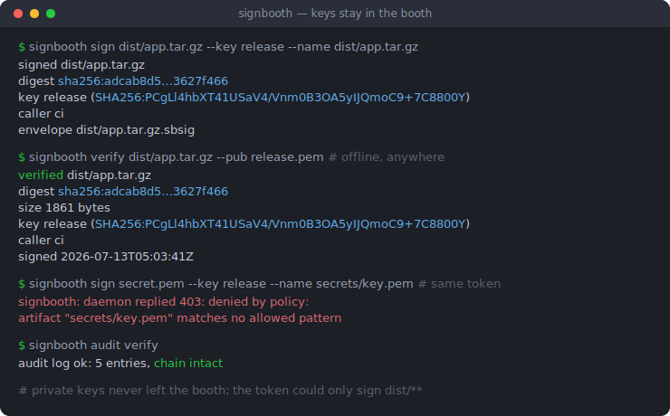
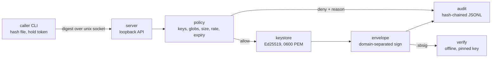

# signbooth

[English](README.md) | [中文](README.zh.md) | [日本語](README.ja.md)

[](LICENSE) [](go.mod) [](CHANGELOG.md)  [](CONTRIBUTING.md)

**signbooth：an open-source artifact-signing daemon — private keys stay in one audited local process, and CI jobs sign through a loopback API under per-caller policy.**



```bash
git clone https://github.com/JaydenCJ/signbooth.git && cd signbooth && go install ./cmd/signbooth
```

> Pre-release: v0.1.0 has no version tag on the Go module proxy yet; install from source as above. A single static binary, no runtime dependencies.

## Why signbooth?

Everyone's dirty secret: the release signing key sits in a CI environment variable, readable by every step of every job, leaked by one `env` in a debug log, and revocable only by rotating the key everywhere at once. The heavyweight fix — sigstore, a cloud KMS, or a Vault cluster — buys real guarantees at the cost of network dependencies, accounts, and operational surface that a solo project or an air-gapped build box can't justify. signbooth is the missing middle: a single static binary holding Ed25519 keys in one locked-down process, signing SHA-256 digests over a unix socket. Each caller gets its own hashed bearer token bound to a policy — which keys, which artifact globs, max size, hourly rate, expiry — every grant and denial lands in a hash-chained audit log, and revoking a token is one command with no restart. Signatures verify fully offline against a pinned key, on machines that have never heard of your booth.

| | signbooth | key in CI env var | sigstore / cosign | cloud KMS / Vault transit |
| --- | --- | --- | --- | --- |
| Key exposure to build jobs | never — jobs hold scoped tokens, keys stay in the daemon | full private key in every job | keyless: OIDC identity instead of a key | none, but every signer needs cloud credentials |
| Works offline / air-gapped | yes, loopback only | yes | no — needs OIDC issuer + transparency log | no — needs the network and the service |
| Per-caller policy (keys, globs, size, rate, expiry) | built in | none | repo/identity level, not artifact globs | IAM policies, no artifact awareness |
| Revoke one consumer | `caller rm`, instant, no restart | rotate the key everywhere | revoke certificate / identity | rotate or revoke credentials |
| Tamper-evident local audit trail | hash-chained JSONL, `audit verify` | none | public transparency log | provider audit service, extra cost |
| Setup footprint | one binary, `init` in seconds | nothing (that's the problem) | CLI + OIDC + Rekor/Fulcio services | cluster or cloud account + SDKs |
| Runtime dependencies | none (Go stdlib) | — | several services | provider SDKs |

<sub>Comparison reflects upstream documentation as of 2026-07. sigstore's keyless flow is the right answer for public open-source supply chains; signbooth targets the private, local, and air-gapped builds where OIDC round-trips are impossible or unwanted.</sub>

## Features

- **Keys never leave the booth** — Ed25519 private keys live in one process behind a 0600 unix socket; the API accepts digests and returns envelopes, so neither key bytes nor artifact bytes ever cross it.
- **Per-caller policy, enforced per request** — each token is bound to key names, artifact globs (`dist/**` — `*` never crosses `/`), a size cap, an hourly rate, and an expiry; policy edits and revocations apply on the very next request without restarting the daemon.
- **A tamper-evident audit chain** — grants, policy denials, and rejected tokens are appended to hash-chained JSONL; `audit verify` pinpoints the first edited, deleted, or reordered line, and concurrent writers share one chain via file locking.
- **Verification is offline and paranoid** — `.sbsig` envelopes are self-describing JSON, but pinning is mandatory; verification checks domain-separated signatures, a key-fingerprint cross-check against re-signed payloads, and the artifact's digest and size.
- **Honest failure modes** — malformed policy fails closed, ambiguous tokens refuse to authenticate, denials quote the exact reason to both the caller and the audit log, and exit codes distinguish "no" (1) from "broken" (2/3).
- **Zero dependencies, loopback only** — pure Go stdlib, one static binary; the daemon refuses to bind non-loopback addresses by design, sends nothing anywhere, and its suite is 90 offline tests plus an end-to-end smoke script.

## Quickstart

Operator: create the booth, one key, and one scoped caller (real captured output, token redacted):

```bash
signbooth init
signbooth key new release
signbooth caller add ci --key release --artifact 'dist/**' --rate 100 --ttl 30d
signbooth serve &
```

```text
caller    ci
keys      release
artifacts dist/**
max size  unlimited
rate      100/hour
expires   2026-08-12T05:03:40Z
token     sbt_aaaaaaaaaaaaaaaaaaaaaaaaaaaaaaaaaaaaaaaaaaaaaaaa
          (shown once — store it in your CI secret store, never on disk)
```

CI job: sign with the token — the file is hashed locally, only the digest crosses the socket:

```bash
export SIGNBOOTH_TOKEN=sbt_aaaaaaaaaaaaaaaaaaaaaaaaaaaaaaaaaaaaaaaaaaaaaaaa
signbooth sign dist/app.tar.gz --key release --name dist/app.tar.gz
```

```text
signed    dist/app.tar.gz
digest    sha256:adcab8d52d684b0779e0017d98ab39800875b336f48bf0075e6086313627f466
key       release (SHA256:PCgLl4hbXT41USaV4/Vnm0B3OA5yIJQmoC9+7C8800Y)
caller    ci
envelope  dist/app.tar.gz.sbsig
```

Anyone, anywhere, fully offline — and the same token cannot step outside its globs:

```text
$ signbooth verify dist/app.tar.gz --pub release.pem
verified  dist/app.tar.gz
digest    sha256:adcab8d52d684b0779e0017d98ab39800875b336f48bf0075e6086313627f466
size      1861 bytes
key       release (SHA256:PCgLl4hbXT41USaV4/Vnm0B3OA5yIJQmoC9+7C8800Y)
caller    ci
signed    2026-07-13T05:03:41Z
$ signbooth sign secret.pem --key release --name secrets/key.pem
signbooth: daemon replied 403: denied by policy: artifact "secrets/key.pem" matches no allowed pattern
```

Runnable operator / CI / consumer scripts live in [examples/](examples/README.md).

## Commands and policy flags

| Command | Role | Effect |
| --- | --- | --- |
| `init`, `key new/ls/export`, `caller add/ls/rm` | operator | manage the booth home, keys (PKIX PEM export), and caller tokens |
| `serve` | operator | run the daemon on `unix://$SIGNBOOTH_HOME/booth.sock` or `127.0.0.1:PORT` |
| `sign <file>`, `status`, `whoami` | caller | sign via the daemon; inspect health and own policy |
| `verify <file>` | anyone | offline check against `--pub key.pem` or `--fingerprint SHA256:…` |
| `audit show/verify` | operator | read the log; verify the hash chain end to end |

| Policy flag (`caller add`) | Default | Effect |
| --- | --- | --- |
| `--key NAME` (repeatable) | required | key names this caller may use; `'*'` = any key |
| `--artifact GLOB` (repeatable) | required | allowed artifact names; `*`/`?` stay within one `/` segment, `**` spans |
| `--max-size N` | unlimited | largest artifact (e.g. `64MB`) |
| `--rate N` | unlimited | signatures per hour |
| `--ttl D` | never expires | token lifetime (e.g. `30d`, `720h`) |

Wire and file formats — routes, the signed payload, domain separation, and the audit chain — are specified in [docs/protocol.md](docs/protocol.md).

## Architecture



The left half needs the daemon; `verify` on the right needs only the artifact, the envelope, and a pinned key.

## Roadmap

- [x] v0.1.0 — signing daemon (unix socket / loopback TCP), per-caller policy with globs/size/rate/TTL, hash-chained audit log, offline pinned verification, key & caller lifecycle CLI, zero dependencies, 90 tests + smoke script
- [ ] `caller update` for editing policy without rotating the token
- [ ] Age-encrypted keystore at rest (passphrase unlock on `serve`)
- [ ] Envelope timestamps countersigned by the audit chain head
- [ ] systemd socket activation and a hardened unit file example
- [ ] Optional in-toto / SLSA provenance statement output alongside `.sbsig`

See the [open issues](https://github.com/JaydenCJ/signbooth/issues) for the full list.

## Contributing

Bug reports, policy-model critiques and pull requests are welcome — see [CONTRIBUTING.md](CONTRIBUTING.md) for the local workflow (`go test ./...` plus `scripts/smoke.sh` printing `SMOKE OK`). Good entry points are labelled [good first issue](https://github.com/JaydenCJ/signbooth/issues?q=is%3Aissue+is%3Aopen+label%3A%22good+first+issue%22), and design questions live in [Discussions](https://github.com/JaydenCJ/signbooth/discussions).

## License

[MIT](LICENSE)
