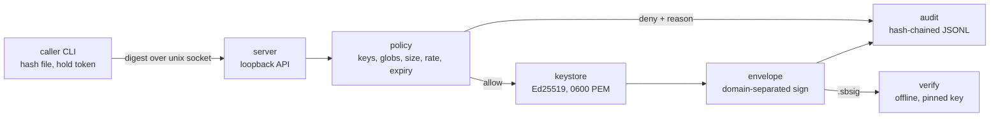

# signbooth

[English](README.md) | [中文](README.zh.md) | [日本語](README.ja.md)

[](LICENSE) [](go.mod) [](CHANGELOG.md)  [](CONTRIBUTING.md)

**signbooth：开源的制品签名守护进程——私钥只存在于一个受审计的本地进程中，CI 任务通过环回 API 在按调用方划分的策略约束下签名。**


```bash
git clone https://github.com/JaydenCJ/signbooth.git && cd signbooth && go install ./cmd/signbooth
```

> 预发布：v0.1.0 尚未在 Go module proxy 上打版本标签；请按上述方式从源码安装。单个静态二进制，零运行时依赖。

## 为什么选 signbooth？

每个团队都有这个难以启齿的秘密：发布签名私钥躺在 CI 环境变量里，任何任务的任何步骤都能读到，调试日志里一句 `env` 就会泄露，撤销的唯一办法是到处同时换钥匙。重量级方案——sigstore、云 KMS 或 Vault 集群——用网络依赖、账号体系和运维负担换来真正的保障，但对个人项目或离线构建机来说根本不划算。signbooth 是缺失的中间层：一个静态二进制把 Ed25519 私钥锁在一个进程里，通过 unix socket 对 SHA-256 摘要签名。每个调用方拿到各自经哈希存储的 bearer token，并绑定策略——能用哪些钥匙、哪些制品 glob、大小上限、每小时频率、过期时间——每次放行与拒绝都写入哈希链审计日志，吊销一个 token 只需一条命令、无需重启。签名可在从未见过 booth 的机器上凭固定公钥完全离线验证。

| | signbooth | CI 环境变量里的私钥 | sigstore / cosign | 云 KMS / Vault transit |
| --- | --- | --- | --- | --- |
| 构建任务能否接触私钥 | 永远不能——任务只持有受限 token，私钥留在守护进程里 | 每个任务都拿到完整私钥 | 无钥匙：以 OIDC 身份代替私钥 | 接触不到，但每个签名者都要有云凭证 |
| 离线 / 隔离网络可用 | 可以，仅环回 | 可以 | 不行——需要 OIDC 签发方与透明日志 | 不行——需要网络与该服务 |
| 按调用方策略（钥匙、glob、大小、频率、过期） | 内置 | 无 | 到仓库/身份级别，没有制品 glob | IAM 策略，不感知制品 |
| 吊销单个使用方 | `caller rm`，即时生效，无需重启 | 到处轮换钥匙 | 吊销证书 / 身份 | 轮换或吊销凭证 |
| 防篡改的本地审计记录 | 哈希链 JSONL，`audit verify` | 无 | 公开透明日志 | 云商审计服务，额外收费 |
| 部署成本 | 一个二进制，几秒 `init` | 零成本（这正是问题所在） | CLI + OIDC + Rekor/Fulcio 服务 | 集群或云账号 + SDK |
| 运行时依赖 | 无（Go 标准库） | — | 多个服务 | 云商 SDK |

<sub>对比基于 2026-07 各上游文档。sigstore 的无钥匙流程是公共开源供应链的正确答案；signbooth 面向私有、本地与离线构建——那些无法或不愿做 OIDC 往返的场景。</sub>

## 功能特性

- **私钥永不出亭** —— Ed25519 私钥只存在于 0600 unix socket 背后的一个进程里；API 只收摘要、只回信封，私钥字节与制品字节都不会经过它。
- **按调用方策略、逐请求强制执行** —— 每个 token 绑定钥匙名单、制品 glob（`dist/**`——`*` 绝不跨越 `/`）、大小上限、每小时频率与过期时间；策略修改和吊销在下一个请求即刻生效，守护进程无需重启。
- **防篡改审计链** —— 放行、策略拒绝与非法 token 都追加进哈希链 JSONL；`audit verify` 精确指出第一处被修改、删除或调序的行，多个写入方通过文件锁共享同一条链。
- **验证离线且多疑** —— `.sbsig` 信封是自描述 JSON，但公钥固定（pinning）为强制项；验证包含域分隔签名校验、防重签的指纹交叉核对，以及制品摘要与大小复核。
- **诚实的失败方式** —— 策略文件损坏即拒绝、token 哈希歧义即拒认，每次拒绝把同一条原因原样给调用方并写入审计日志，退出码区分"不行"（1）与"出错"（2/3）。
- **零依赖、仅环回** —— 纯 Go 标准库，单个静态二进制；守护进程从设计上拒绝绑定非环回地址、不向任何地方发送数据，自带 90 个离线测试与端到端冒烟脚本。

## 快速上手

运维方：创建 booth、一把钥匙和一个受限调用方（真实捕获输出，token 已作脱敏）：

```bash
signbooth init
signbooth key new release
signbooth caller add ci --key release --artifact 'dist/**' --rate 100 --ttl 30d
signbooth serve &
```

```text
caller    ci
keys      release
artifacts dist/**
max size  unlimited
rate      100/hour
expires   2026-08-12T05:03:40Z
token     sbt_aaaaaaaaaaaaaaaaaaaaaaaaaaaaaaaaaaaaaaaaaaaaaaaa
          (shown once — store it in your CI secret store, never on disk)
```

CI 任务：用 token 签名——文件在本地哈希，只有摘要经过 socket：

```bash
export SIGNBOOTH_TOKEN=sbt_aaaaaaaaaaaaaaaaaaaaaaaaaaaaaaaaaaaaaaaaaaaaaaaa
signbooth sign dist/app.tar.gz --key release --name dist/app.tar.gz
```

```text
signed    dist/app.tar.gz
digest    sha256:adcab8d52d684b0779e0017d98ab39800875b336f48bf0075e6086313627f466
key       release (SHA256:PCgLl4hbXT41USaV4/Vnm0B3OA5yIJQmoC9+7C8800Y)
caller    ci
envelope  dist/app.tar.gz.sbsig
```

任何人、任何机器、完全离线——而同一个 token 迈不出自己的 glob 半步：

```text
$ signbooth verify dist/app.tar.gz --pub release.pem
verified  dist/app.tar.gz
digest    sha256:adcab8d52d684b0779e0017d98ab39800875b336f48bf0075e6086313627f466
size      1861 bytes
key       release (SHA256:PCgLl4hbXT41USaV4/Vnm0B3OA5yIJQmoC9+7C8800Y)
caller    ci
signed    2026-07-13T05:03:41Z
$ signbooth sign secret.pem --key release --name secrets/key.pem
signbooth: daemon replied 403: denied by policy: artifact "secrets/key.pem" matches no allowed pattern
```

可直接运行的运维 / CI / 消费方脚本见 [examples/](examples/README.md)。

## 命令与策略参数

| 命令 | 角色 | 作用 |
| --- | --- | --- |
| `init`、`key new/ls/export`、`caller add/ls/rm` | 运维方 | 管理 booth 目录、钥匙（PKIX PEM 导出）与调用方 token |
| `serve` | 运维方 | 在 `unix://$SIGNBOOTH_HOME/booth.sock` 或 `127.0.0.1:PORT` 上运行守护进程 |
| `sign <file>`、`status`、`whoami` | 调用方 | 经守护进程签名；查看健康状态与自身策略 |
| `verify <file>` | 任何人 | 凭 `--pub key.pem` 或 `--fingerprint SHA256:…` 离线校验 |
| `audit show/verify` | 运维方 | 读取日志；端到端验证哈希链 |

| 策略参数（`caller add`） | 默认值 | 作用 |
| --- | --- | --- |
| `--key NAME`（可重复） | 必填 | 该调用方可用的钥匙名；`'*'` = 任意钥匙 |
| `--artifact GLOB`（可重复） | 必填 | 允许的制品名；`*`/`?` 不跨 `/` 段，`**` 可跨段 |
| `--max-size N` | 不限 | 最大制品体积（如 `64MB`） |
| `--rate N` | 不限 | 每小时签名次数 |
| `--ttl D` | 永不过期 | token 有效期（如 `30d`、`720h`） |

线上与文件格式——路由、被签名载荷、域分隔与审计链——详见 [docs/protocol.md](docs/protocol.md)。

## 架构



左半边需要守护进程；右侧的 `verify` 只需要制品、信封和一把固定公钥。

## 路线图

- [x] v0.1.0 —— 签名守护进程（unix socket / 环回 TCP）、含 glob/大小/频率/TTL 的按调用方策略、哈希链审计日志、离线固定公钥验证、钥匙与调用方生命周期 CLI、零依赖、90 个测试 + 冒烟脚本
- [ ] `caller update`：不换 token 也能修改策略
- [ ] 静态密钥库 age 加密（`serve` 时口令解锁）
- [ ] 信封时间戳由审计链头做副署
- [ ] systemd socket 激活与加固 unit 文件示例
- [ ] 可选在 `.sbsig` 之外输出 in-toto / SLSA 来源声明

完整列表见 [open issues](https://github.com/JaydenCJ/signbooth/issues)。

## 参与贡献

欢迎 bug 报告、策略模型的批评与 pull request——本地流程（`go test ./...` 加上打印 `SMOKE OK` 的 `scripts/smoke.sh`）见 [CONTRIBUTING.md](CONTRIBUTING.md)。入门任务标注为 [good first issue](https://github.com/JaydenCJ/signbooth/issues?q=is%3Aissue+is%3Aopen+label%3A%22good+first+issue%22)，设计讨论在 [Discussions](https://github.com/JaydenCJ/signbooth/discussions)。

## 许可证

[MIT](LICENSE)
